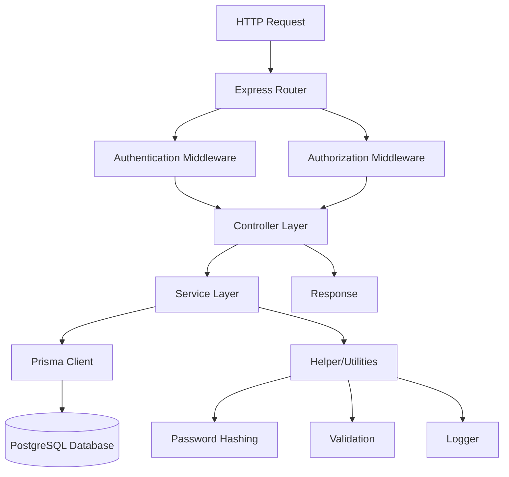

# Semeru API

[](https://nodejs.org/)
[](https://www.typescriptlang.org/)
[](https://expressjs.com/)
[](https://www.prisma.io/)
[](https://www.postgresql.org/)
[](https://jwt.io/)

A robust REST API built with Node.js and TypeScript for user authentication and management, designed for educational platforms. The system implements role-based access control with support for students (Mahasiswa), mentors, and administrators.

## Description

Semeru API is a comprehensive backend solution for managing user authentication, authorization, and related services in an educational context. The platform supports multiple user roles and provides secure endpoints for user management, with planned extensions for content management (CMS), monitoring/tracking (Jejak), and event management (Laga) services.

The API follows a layered architecture pattern, ensuring maintainability, scalability, and clean separation of concerns. It uses modern development practices including TypeScript for type safety, Prisma ORM for database operations, and comprehensive validation with Zod.

## Architecture

The project follows a **Layered Architecture** pattern with clear separation of concerns:

- **Presentation Layer**: Express.js routes and controllers handling HTTP requests/responses
- **Business Logic Layer**: Service classes containing domain logic and business rules
- **Data Access Layer**: Prisma ORM managing database operations and queries
- **Infrastructure Layer**: Configuration, logging, authentication middleware, and utilities

### Architecture Diagram



## Tech Stack

### Core Framework & Runtime
- **Node.js** 18+ - JavaScript runtime
- **TypeScript** 5.9+ - Type-safe JavaScript
- **Express.js** 5.2+ - Web framework

### Database & ORM
- **PostgreSQL** 13+ - Primary database
- **Prisma** 7.2+ - ORM with type-safe database access
- **@prisma/adapter-pg** - PostgreSQL adapter for Prisma

### Authentication & Security
- **JWT** (jsonwebtoken) - Token-based authentication
- **bcrypt** - Password hashing
- **Helmet** - Security headers
- **CORS** - Cross-origin resource sharing

### Validation & Utilities
- **Zod** - Schema validation
- **Morgan** - HTTP request logging
- **Dotenv** - Environment configuration

### Development Tools
- **Nodemon** - Development server with auto-reload
- **Jest** - Testing framework
- **TS-Node** - TypeScript execution

## Getting Started

### Prerequisites

- Node.js 18 or higher
- PostgreSQL 13 or higher
- npm or yarn package manager

### Installation

1. **Clone the repository**
   ```bash
   git clone https://github.com/taufanAli65/semeru.git
   cd semeru/api
   ```

2. **Install dependencies**
   ```bash
   npm install
   ```

3. **Environment Setup**
   ```bash
   cp ../.env.local.example .env
   # Edit .env with your database credentials and other settings
   ```

4. **Database Setup**
   ```bash
   # Generate Prisma client
   npx prisma generate

   # Run database migrations
   npx prisma migrate dev

   # Seed initial data (creates super admin account)
   npm run prisma:seed
   ```

5. **Build and Run**
   ```bash
   # Development mode
   npm run dev

   # Production build
   npm run build
   npm start
   ```

The API will be available at `http://localhost:8000` (or your configured PORT).

### Available Scripts

- `npm run dev` - Start development server with hot reload
- `npm run build` - Build TypeScript to JavaScript
- `npm start` - Start production server
- `npm test` - Run tests
- `npx prisma studio` - Open Prisma Studio for database management
- `npx prisma migrate dev` - Run database migrations in development
- `npx prisma generate` - Generate Prisma client

## Project Structure

```
api/
├── src/
│   ├── app.ts                 # Express application setup
│   ├── server.ts              # Server entry point
│   ├── config/
│   │   ├── index.config.ts    # Environment configuration
│   │   └── prisma.config.ts   # Database configuration
│   ├── controllers/
│   │   └── authentication.controller.ts  # Auth endpoints logic
│   ├── helpers/
│   │   ├── password.helper.ts # Password hashing utilities
│   │   └── validator.helper.ts # Request validation wrapper
│   ├── middlewares/
│   │   ├── authenticate.middleware.ts    # JWT authentication
│   │   ├── authorize.middleware.ts       # Role-based authorization
│   │   └── errorHandler.middleware.ts    # Global error handling
│   ├── routes/
│   │   └── authentication.router.ts      # Auth API routes
│   ├── services/
│   │   ├── authentication/
│   │   │   └── user.service.ts           # User business logic
│   │   ├── cms/                          # Planned: Content Management
│   │   ├── jejak/                        # Planned: Monitoring/Tracking
│   │   └── laga/                         # Planned: Events/Activities
│   ├── types/
│   │   └── authentication.type.ts        # TypeScript type definitions
│   ├── utils/
│   │   └── logger.utils.ts               # Logging utilities
│   └── validators/
│       └── authentication.validator.ts   # Request validation schemas
├── prisma/
│   ├── schema.prisma         # Database schema definition
│   ├── seed.ts              # Database seeding script
│   └── migrations/          # Database migration files
├── logs/                    # Application log files
├── package.json
├── tsconfig.json
└── .gitignore
```

### Key Directories Explanation

- **`src/controllers/`** - Handle HTTP requests, validate input, and return responses
- **`src/services/`** - Contain business logic and interact with data layer
- **`src/routes/`** - Define API endpoints and connect to controllers
- **`src/middlewares/`** - Cross-cutting concerns like authentication and error handling
- **`src/helpers/`** - Utility functions for common operations
- **`prisma/`** - Database schema, migrations, and seeding
- **`src/config/`** - Application configuration and environment settings

## Features

### ✅ Implemented Features

#### Authentication & User Management
- **User Registration** - Register new users with role assignment
- **User Login** - JWT-based authentication
- **User Profile Management** - Update user information
- **Role-Based Access Control** - SuperAdmin, Admin, Mentor, Mahasiswa roles
- **User CRUD Operations** - Admin-only user management endpoints

#### Security Features
- JWT token authentication with configurable expiration
- Password hashing with bcrypt
- Role-based authorization middleware
- Security headers via Helmet
- CORS configuration
- Request validation with Zod schemas

#### Developer Experience
- TypeScript for type safety
- Comprehensive logging with configurable levels
- Environment-based configuration
- Database seeding for development
- Hot reload in development mode

### 🚧 Planned Features

#### Content Management System (CMS)
- Static content management
- File upload handling
- Content categorization

#### Jejak (Monitoring/Tracking)
- Student progress tracking
- Achievement recording
- Performance monitoring
- Mentor-student assignments

#### Laga (Events/Activities)
- Event creation and management
- Activity registration system
- Certificate generation
- Event analytics

## API Endpoints

For comprehensive API documentation including detailed request/response examples, authentication, and usage guides, see:

📖 **[Complete API Documentation](../docs/api-doc.md)**

### Quick API Reference

### Authentication Routes (`/api/v1/auth`)

| Method | Endpoint | Description | Access |
|--------|----------|-------------|---------|
| POST | `/login` | User authentication | Public |
| POST | `/register` | User registration | Public |
| GET | `/user/:userId` | Get user profile | Authenticated |
| PUT | `/user/info` | Update user information | Authenticated |
| GET | `/users` | Get all users | SuperAdmin |
| DELETE | `/user/:userId` | Delete user | SuperAdmin |
| PATCH | `/user/:userId/role` | Change user role | SuperAdmin |
| GET | `/users/role/:role` | Get users by role | SuperAdmin |

### Monev (Monitoring & Evaluation) Routes (`/api/v1/jejak`)

#### Mentor Endpoints
| Method | Endpoint | Description | Access |
|--------|----------|-------------|---------|
| POST | `/mentor/:mentorId/mentees` | Assign mentees to mentor | Admin, Mentor |
| GET | `/mentor/:mentorId/mentees` | Get mentee list | Admin, Mentor |
| PATCH | `/mentor/records/:record_id` | Approve/reject records | Admin, Mentor |
| GET | `/mentor/period/:period_id/records` | Get period records | Admin, Mentor |
| GET | `/mentor/records/:record_id` | Get single record | Admin, Mentor |

#### Mentee Endpoints
| Method | Endpoint | Description | Access |
|--------|----------|-------------|---------|
| POST | `/mentee/records` | Add single record | Mahasiswa |
| POST | `/mentee/records/bulk` | Add bulk records | Mahasiswa |
| GET | `/mentee/records/current` | Get current period | Mahasiswa |
| PATCH | `/mentee/records/:record_id` | Update record | Mahasiswa |
| DELETE | `/mentee/records/:record_id` | Delete record | Mahasiswa |
| GET | `/mentee/records/past` | Get past records | Mahasiswa |

### Health Check
| Method | Endpoint | Description | Access |
|--------|----------|-------------|---------|
| GET | `/api/v1/health` | API health status | Public |

## Database Schema

The application uses PostgreSQL with the following main entities:

- **Users** - User accounts with roles and authentication
- **User Information** - Extended profile data for students/mentors
- **Activities** - Events and activities (planned)
- **Activity Registrations** - User participation records (planned)
- **Monev Periods** - Monitoring periods for students (planned)
- **Monev Records** - Achievement and performance records (planned)

## Environment Variables

### Required Variables
- `DATABASE_URL` - PostgreSQL connection string
- `JWT_SECRET` - Secret key for JWT signing
- `SEEDER_PASSWORD` - Password for initial super admin account

### Optional Variables
- `NODE_ENV` - Environment (development/production)
- `PORT` - Server port (default: 8000)
- `JWT_EXPIRES_IN` - JWT token expiration (default: 24h)
- `LOG_LEVEL` - Logging level (DEBUG/INFO/WARN/ERROR)
- `ALLOWED_ORIGINS` - CORS allowed origins

## Contributing

1. Fork the repository
2. Create a feature branch (`git checkout -b feature/amazing-feature`)
3. Commit your changes (`git commit -m 'Add amazing feature'`)
4. Push to the branch (`git push origin feature/amazing-feature`)
5. Open a Pull Request

## License

This project is licensed under the ISC License - see the package.json file for details.

## Author

**taufanAli65**
- GitHub: [@taufanAli65](https://github.com/taufanAli65)</content>
<parameter name="filePath">/Users/alienz/mgondinf/semeru/README.md